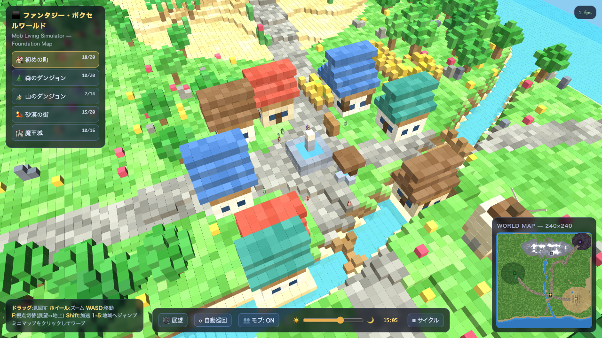

# ファンタジー・ボクセルワールド (Fantasy Voxel World)

Three.jsを用いたブラウザで動作する3Dボクセルワールド・Mob生活シミュレーターです。



## 主な機能
- **広大なボクセルマップ (240×240)**: 起伏に富んだファンタジー世界をプロシージャル生成
- **モブ生活シミュレーション**: 街や平原を歩き回るNPCモブ
- **時間・天候サイクル**: 太陽と月の運行、昼夜の時間帯変化
- **インタラクティブな視点操作**: 展望モード（鳥瞰）と地上モード（ウォークスルー）のシームレス切替
- **ミニマップ**: クリックした地点への即時ワープ機能

## 操作方法
| キー / 操作 | 動作 |
|---|---|
| **ドラッグ (マウス左)** | カメラの回転（見回す） |
| **マウスホイール** | ズームイン / ズームアウト |
| **W / A / S / D** | カメラ移動（前後左右） |
| **Shift** | 加速移動 |
| **F** | 視点切替（展望モード ↔ 地上モード） |
| **1 〜 5** | 各地域（集落・ダンジョン等）へのショートカットジャンプ |
| **ミニマップクリック** | クリックした座標へテレポート |

## 起動方法
ブラウザで直接 `index.html` を開くか、ローカルHTTPサーバー（例: `python3 -m http.server` または VS Code Live Server等）を立ち上げてアクセスしてください。

```bash
# 例: Pythonのビルトインサーバー
python3 -m http.server 8000
# http://localhost:8000 にアクセス
```

## ディレクトリ構成
```
.
├── index.html        # メインHTML・UI・スタイル
├── js/
│   ├── app.js        # アプリケーション全体の初期化・メインループ
│   ├── core.js       # コア機能・定数・ユーティリティ
│   ├── mobs.js       # モブ（NPC）の挙動・管理
│   ├── structures.js # 建築物・オブジェクト生成
│   ├── world.js      # 地形・ボクセルワールド生成
│   └── vendor/
│       └── three.min.js # Three.jsライブラリ
├── shots/            # スクリーンショットアセット
│   └── shot1.png
├── .gitignore        # Git除外設定
├── .ignore           # 検索除外設定
├── README.md         # プロジェクト説明
└── TODO.md           # 開発・管理タスク一覧
```
